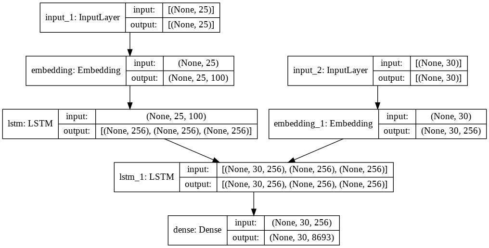
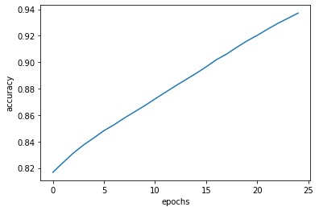
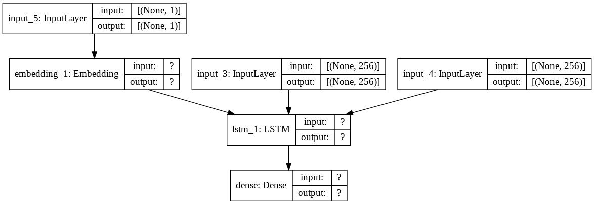

# Deep Neural Network Models for Advanced NLP Problems
Made by Gabriel PRECIGOUT and Stanislas KIESGEN DE RICHTER

## Task 1 : Creating a Machine Translation System

### Introduction

In this notebook, we built a deep neural network that uses Sequence-to-sequence(Seq2seq)


```python
from google.colab import drive
drive.mount('/content/drive/')
```

    Mounted at /content/drive/


```python
import numpy as np
import pandas as pd
import matplotlib.pyplot as plt
import random
import tensorflow as tf
import datetime, os
from keras.models import Model
from keras.layers import Input, LSTM, GRU, Dense, Embedding
from keras.preprocessing.text import Tokenizer
from keras.preprocessing.sequence import pad_sequences
from keras.utils import to_categorical, plot_model
from numpy import array, asarray, zeros

%load_ext tensorboard
```

### Definition of the Hyperparameters


```python
BATCH_SIZE = 64
EPOCHS = 25
LSTM_NODES =256
NUM_SENTENCES = 8000
MAX_SENTENCE_LENGTH = 50
MAX_NUM_WORDS = 20000
EMBEDDING_SIZE = 100

```

### Data preprocessing

Randomizing the text file to improve our model 


```python
#with open('/content/drive/MyDrive/Data/fra.txt','r') as source:
#    data = [ (random.random(), line) for line in source ]
#data.sort()
#with open('/content/drive/MyDrive/Data/fra_random.txt','w') as target:
#    for _, line in data:
#        target.write( line )
```

Transforming the data from the text file to an array


```python
input_sentences = []
end_of_sentences_outputs = []
start_of_sentence_outputs = []
test_outputs = []
 
count = 0
for line in open(r'/content/drive/MyDrive/Data/fra_random.txt', encoding="utf-8"):
    count += 1
 
    if count > NUM_SENTENCES:
        break
 
    if '\t' not in line:
        continue
    
    input_sentence, output, attribution = line.rstrip().split('\t')

    test_output = output
    end_of_sentences_output = output + ' <eos>'
    start_of_sentence_output = '<sos> ' + output

    test_outputs.append(test_output)
    input_sentences.append(input_sentence)
    end_of_sentences_outputs.append(end_of_sentences_output)
    start_of_sentence_outputs.append(start_of_sentence_output)
 
print("number of samples in the input_sentences:", len(input_sentences))
print("number of samples in the end_of_sentences_outputs:", len(end_of_sentences_outputs))
print("number of samples in the start-of-sentences_outputs:", len(start_of_sentence_outputs))
```

    number of samples in the input_sentences: 8000
    number of samples in the end_of_sentences_outputs: 8000
    number of samples in the start-of-sentences_outputs: 8000


```python
print(input_sentences)
```

    ['Tom renamed the folder.', "Tom says he hasn't eaten in three days.", 'He is able to speak five languages.', "I'm pretty sure that Tom doesn't have a brother.", "I don't mind a bit.", "It's not as easy as people think.", 'I told you it was dangerous.', 'They tried to discourage him from going.', 'It makes sense.', 'That man looks familiar.', 'What else can go wrong?', 'Tom wanted one, but he had no idea where he could get one.', 'He is a doctor.', 'Tell us a ghost story.', 'What made you ask that question?', "Don't release that dog.", 'You need to work together.', "I can't eat that.", 'Here comes the train.', "I don't want to be a burden to you.", 'The train arrives at platform number 5.', "I don't talk about you behind your back.", "Tom parked the car behind Mary's house.", 
    
    {...}
    
    'Look at me when I talk to you!', 'Can I get you something to drink?', 'Did you recognize any of those people?', 'I had to see you again.', 'You deserve more than that.', 'Come sit with us.', 'Tom {looked very concerned.']


Printing what we're supposed to translate and how it looks


```python
print(input_sentences[42])
print(end_of_sentences_outputs[42])
print(start_of_sentence_outputs[42])
```

    I'm done fooling around now.
    J'en ai fini de faire l'andouille. <eos>
    <sos> J'en ai fini de faire l'andouille.


### Tokenization


```python
input_tokenizer = Tokenizer(num_words=MAX_NUM_WORDS)
input_tokenizer.fit_on_texts(input_sentences)
input_integer_sequence = input_tokenizer.texts_to_sequences(input_sentences)

inputs_convert_word_to_wordIndex = input_tokenizer.word_index
print('Total unique words in the input: %s' % len(inputs_convert_word_to_wordIndex))

len_longest_input_sentence = max(len(sen) for sen in input_integer_sequence)
print("Length of longest sentence in input: %g" % len_longest_input_sentence)
```

    Total unique words in the input: 4261
    Length of longest sentence in input: 25


```python
output_tokenizer = Tokenizer(num_words=MAX_NUM_WORDS, filters='')
output_tokenizer.fit_on_texts(end_of_sentences_outputs + start_of_sentence_outputs)
output_integer_seq = output_tokenizer.texts_to_sequences(end_of_sentences_outputs)
output_input_integer_sequence = output_tokenizer.texts_to_sequences(start_of_sentence_outputs)

word2idx_outputs = output_tokenizer.word_index
print('Total unique words in the output: %s' % len(word2idx_outputs))

num_words_output = len(word2idx_outputs) + 1
max_out_len = max(len(sen) for sen in output_integer_seq)
print("Length of longest sentence in the output: %g" % max_out_len)
```

    Total unique words in the output: 8692
    Length of longest sentence in the output: 30


Padding the input_sequence_encoder so that all sentences have the same length


```python
input_sequences_encoder = pad_sequences(input_integer_sequence, maxlen=len_longest_input_sentence)
print("input_sequences_encoder.shape:", input_sequences_encoder.shape)
print("input_sequences_encoder[42]:", input_sequences_encoder[42])
```

    input_sequences_encoder.shape: (8000, 25)
    input_sequences_encoder[42]: [   0    0    0    0    0    0    0    0    0    0    0    0    0    0
        0    0    0    0    0    0   21  147 2223  511   95]


Padding the input_sequence_decoder


```python
input_sequences_decoder = pad_sequences(output_input_integer_sequence, maxlen=max_out_len, padding='post')
print("input_sequences_decoder.shape:", input_sequences_decoder.shape)
print("input_sequences_decoder[172]:", input_sequences_decoder[172])
```

    input_sequences_decoder.shape: (8000, 30)
    input_sequences_decoder[172]: [   2   14 2052   70 1464    0    0    0    0    0    0    0    0    0
        0    0    0    0    0    0    0    0    0    0    0    0    0    0
        0    0]


### Word Embedding


```python
embeddings_dictionary = dict()

glove = open(r'/content/drive/MyDrive/Data/glove.6B.100d.txt', encoding="utf8")

for line in glove:
    glove_records = line.split()
    glove_word = glove_records[0]
    vector_dimensions = asarray(glove_records[1:], dtype='float32')
    embeddings_dictionary[glove_word] = vector_dimensions
glove.close()
```


```python
num_words = min(MAX_NUM_WORDS, len(inputs_convert_word_to_wordIndex) + 1)
embedding_matrix = zeros((num_words, EMBEDDING_SIZE))
for word, index in inputs_convert_word_to_wordIndex.items():
    embedding_vector = embeddings_dictionary.get(word)
    if embedding_vector is not None:
        embedding_matrix[index] = embedding_vector
```


```python
embedding_layer = Embedding(num_words, EMBEDDING_SIZE, weights=[embedding_matrix], input_length=len_longest_input_sentence)
```


```python
one_hot_decoder = np.zeros((
        len(input_sentences),
        max_out_len,
        num_words_output
    ),
    dtype='float32'
)
```


```python
one_hot_decoder.shape
```


    (8000, 30, 8693)


```python
output_sequences_decoder = pad_sequences(output_integer_seq, maxlen=max_out_len, padding='post')
```


```python
for i, d in enumerate(output_sequences_decoder):
    for t, word in enumerate(d):
        one_hot_decoder[i, t, word] = 1
```


```python
inputs_placeholder_encoder = Input(shape=(len_longest_input_sentence,))
x = embedding_layer(inputs_placeholder_encoder)
encoder = LSTM(LSTM_NODES, return_state=True)

encoder_outputs, hidden, cell = encoder(x)
encoder_states = [hidden, cell]
```


```python
inputs_placeholder_decoder = Input(shape=(max_out_len,))

embedding_decoder = Embedding(num_words_output, LSTM_NODES)
inputs_decoder = embedding_decoder(inputs_placeholder_decoder)

lstm_decoder = LSTM(LSTM_NODES, return_sequences=True, return_state=True)
decoder_outputs, _, _ = lstm_decoder(inputs_decoder, initial_state=encoder_states)
```


```python
dense_decoder = Dense(num_words_output, activation='softmax')
decoder_outputs = dense_decoder(decoder_outputs)
```


```python
model = Model([inputs_placeholder_encoder,
  inputs_placeholder_decoder], decoder_outputs)
model.compile(
    optimizer='rmsprop',
    loss='categorical_crossentropy',
    metrics=['accuracy']
)
```


```python
plot_model(model, to_file='model_plot_1.png', show_shapes=True, show_layer_names=True)
```


    

    


```python
logdir = os.path.join("logs", datetime.datetime.now().strftime("%Y%m%d-%H%M%S"))
tensorboard_callback = tf.keras.callbacks.TensorBoard(logdir, histogram_freq=1)
```


```python
model.load_weights("/content/drive/MyDrive/Data/saved_weights.hdf5")
r = model.fit(
    [input_sequences_encoder, input_sequences_decoder],
    one_hot_decoder,
    batch_size=BATCH_SIZE,
    epochs=EPOCHS,
    validation_split=0.1,
    callbacks=[tensorboard_callback]
)
model.save_weights('/content/drive/MyDrive/Data/saved_weights.hdf5',overwrite=True)
```


```python
%tensorboard --logdir logs
```


    <IPython.core.display.Javascript object>


```python
# Ploting Loss per Epochs
plt.plot(range(len(model.history.history['val_loss'])),model.history.history['loss'])
plt.xlabel("epochs")
plt.ylabel("loss")
plt.show()
```


```python
# Ploting accuracy per Epochs
plt.plot(range(len(model.history.history['val_accuracy'])),model.history.history['accuracy'])
plt.xlabel("epochs")
plt.ylabel("accuracy")
plt.show()
```


    

    


```python
model.save_weights('/content/drive/MyDrive/Data/saved_weights.hdf5',overwrite=True)
```


```python
encoder_model = Model(inputs_placeholder_encoder, encoder_states)
```


```python
decoder_state_input_hidden = Input(shape=(LSTM_NODES,))
decoder_state_input_cell = Input(shape=(LSTM_NODES,))
decoder_states_inputs = [decoder_state_input_hidden, decoder_state_input_cell]
```


```python
single_inputs_decoder = Input(shape=(1,))
single_x_inputs_decoder = embedding_decoder(single_inputs_decoder)
```


```python
decoder_outputs, hidden, cell = lstm_decoder(single_x_inputs_decoder, initial_state=decoder_states_inputs)
```


```python
decoder_states = [hidden, cell]
decoder_outputs = dense_decoder(decoder_outputs)
```


```python
decoder_model = Model(
    [single_inputs_decoder] + decoder_states_inputs,
    [decoder_outputs] + decoder_states
)
```


```python
plot_model(decoder_model, to_file='model_plot_decoder.png', show_shapes=True, show_layer_names=True)
```


    

    


```python
index_to_word_input = {v:k for k, v in inputs_convert_word_to_wordIndex.items()}
index_to_word_output = {v:k for k, v in word2idx_outputs.items()}
```


```python
def machine_Translation_System(input_sequence):
    values_of_states = encoder_model.predict(input_sequence)
    sequence_translation = np.zeros((1, 1))
    sequence_translation[0, 0] = word2idx_outputs['<sos>']
    eos = word2idx_outputs['<eos>']
    output_sentence = []

    for _ in range(max_out_len):
        output_tokens, hidden, cell = decoder_model.predict([sequence_translation] + values_of_states)
        index_mts = np.argmax(output_tokens[0, 0, :])

        if eos == index_mts:
            break

        word = ''

        if index_mts > 0:
            word = index_to_word_output[index_mts]
            output_sentence.append(word)

        sequence_translation[0, 0] = index_mts
        values_of_states = [hidden, cell]

    return ' '.join(output_sentence)
```


```python
test_outputs = []
 
count1 = 0
for line1 in open(r'/content/drive/MyDrive/Data/fra_random.txt', encoding="utf-8"):
    count1 += 1
 
    if count1 > 8500:
        break
 
    if '\t' not in line1:
        continue
    
    input_sentence1, output1, attribution1 = line1.rstrip().split('\t')

    test_outputs.append(output1)
test_outputs1 = test_outputs[8000:]
```


```python
print(test_outputs1[2])
```

    Par temps chaud, la sueur permet à l'homme de réguler la température de son corps.


```python
test=[]
for i in range(500):
    col = []
    expected = test_outputs[i]
    predicted = machine_Translation_System(input_sequences_encoder[i:i+1])
    col.append(expected)
    col.append(predicted)
    if (expected.lower() == predicted.lower()):
        col.append(1)
    else:
        col.append(0)

    colwordnum = []
    colwordeq = []
    count=0
    temp_expect = expected.lower().split() 
    temp_predict = predicted.lower().split()

    if ( len(temp_expect) <= len(temp_predict)):
      lenw=len(temp_expect)
    else:
      lenw=len(temp_predict)
    

    for j in range (0,lenw):
      if (temp_predict[j]==temp_expect[j]):
        count+=1

    col.append(lenw)
    col.append(count)
    test.append(col)
print(test)
```

    [['Tom renomma le fichier.', 'tom sur le travail ?', 0, 4, 2], ["Tom dit qu'il n'a pas mangé depuis trois jours.", "tom dit qu'il n'a pas mangé depuis trois jours.", 1, 9, 9], ['Il peut parler cinq langues.', "il se faut que parler en monde d'un jours.", 0, 5, 1], ["Je suis pratiquement sûr que Tom n'a pas de frère.", "je suis sûr que tom n'a pas de frère.", 0, 9, 2], ["Je n'y prête pas la moindre attention.", 'je ne me sentais pas un peu !', 0, 7, 1], ["Ce n'est pas aussi simple qu'on le croit.", "ce n'est pas aussi facile à ça.", 0, 7, 4], ["Je vous ai dit que c'était dangereux.", "je vous ai dit que c'était n'était très fini.", 0, 7, 6], ["Elles ont essayé de le décourager d'y aller.", "ils ont essayé de le lui d'y aller.", 0, 8, 6], ['Ça tient debout.', 'ça a vraiment du sens.', 0, 3, 1], ['Cet homme me dit quelque chose.', "ça a l'air quelque chose que dire !", 0, 6, 0], ["Quoi d'autre peut-il foirer ?", "à quoi d'autre d'autre ?", 0, 5, 1], ["Tom en voulait un, mais il n'avait aucune idée d'où en trouver.", "tom a dit qu'il avait aucune idée à ce qu'il qu'il avoir été en train cela.", 0, 12, 1], ['Il est médecin.', 'il est médecin.', 1, 3, 3], ['Racontez-nous une histoire de fantômes.', 'quel pouvait une monde est !', 0, 5, 0], ["Qu'est-ce qui t'a fait poser cette question ?", "qu'est-ce que tu as fait ça ?", 0, 7, 1], ['Ne lâche pas le chien.', 'ne sois pas à la fête !', 0, 5, 2], ['Vous devez travailler ensemble.', 'il faut que vous soyez plus parler.', 0, 4, 0], ['Je ne peux manger cela.', 'je ne peux manger cela.', 1, 5, 5], ['Voilà le train.', 'où est la télévision.', 0, 3, 0], ['Je ne veux pas être un poids pour toi.', 'je ne veux pas être un travail pour toi.', 0, 9, 8], ['Le train arrive au quai numéro 5.', 'le train à train à passer où elle à vous maison un chambre jeune.', 0, 7, 2], ['Je ne parle pas de toi derrière ton dos.', 'je ne suis pas de te dire à quoi ce que tu as !', 0, 9, 4], ['Tom a garé la voiture derrière la maison de Mary.', 'tom a acheté la voiture de la maison de la maison.', 0, 10, 7], ["Aujourd'hui, j'ai bon appétit.", "j'ai beaucoup de bonnes fois pour vous.", 0, 4, 0], ['Nous jouons souvent aux échecs.', 'nous jouons souvent aux échecs.', 1, 5, 5], ["Je n'avais aucune intention de m'y rendre seul.", "je n'avais jamais pensé de faire la question.", 0, 8, 3], ['Et alors ?', 'ça a à quelque chose.', 0, 3, 0], ["Vous êtes la plus jolie femme que j'ai jamais vue.", "vous êtes la plus belle fille que j'ai jamais vue.", 0, 10, 8], ["Tom s'est débarrassé de sa vieille voiture.", 'tom a perdu de sa maison dans sa voiture.', 0, 7, 3], ['Vous ignorez ce que ceci signifie pour nous.', 'vous ne savez pas quoi quoi quoi vous parlez.', 0, 8, 1], ["J'ai des enfants.", "j'ai des enfants.", 1, 3, 3], ['Il y a des choses que vous devez savoir.', 'il y a des choses que vous devez faire ça.', 0, 9, 8], ['Quand êtes-vous arrivées à Boston ?', 'quand êtes-vous arrivées à boston ?', 1, 6, 6], ["J'avais l'intention d'annuler votre rendez-vous d'aujourd'hui.", "je souhaite l'intention de votre jour sont demain.", 0, 6, 0], ["Je savais que c'était Tom.", "je savais que c'était tom.", 1, 5, 5], ['Je suis un de leurs amis.', 'je suis un de leurs amis.', 1, 6, 6], ["J'ai la dalle.", "j'ai très faim.", 0, 3, 1], ['Il est rentré tard hier soir.', "il est rentré chez l'école en retard il soir.", 0, 6, 3], ["Je me sens seul lorsque tu n'es pas là.", "je me sens si tu n'es pas là.", 0, 8, 3], ['Elles ont appelé à mettre fin au combat.', 'ils ont appelé à mettre devant son pièce.', 0, 8, 4], ["J'ai connaissance de cette coutume.", 'je suis sûr de le vol.', 0, 5, 0], ['Entre la viande et le poisson, lequel préférez-vous\u202f?', 'que faites-vous du déjeuner et elle.', 0, 6, 0], ["J'en ai fini de faire l'andouille.", "j'en ai fini de faire ça.", 0, 6, 5], ["Rien ne pourrait l'arrêter.", 'rien ne pourrait se passe.', 0, 4, 3], ['Nous ne sommes pas impressionnées.', 'nous ne sommes pas fier', 0, 5, 4], ['Ne sois pas si pudique.', 'ne sois pas si en train !', 0, 5, 4], ['Cette voiture-ci est plus grande que celle-là.', 'cette voiture est plus grande grande grande que celle-là.', 0, 7, 4], ['Je fais les règles.', 'je les règles.', 0, 3, 1], ["J'ai besoin que tu viennes avec moi.", 'je dois vous me rendre chez moi.', 0, 7, 1], ["Il s'agissait d'un crime passionnel.", 'il était un verre pour avoir du monde du ai avoir un verre à boire.', 0, 5, 1], ['Assurez-vous de sauvegarder tous vos fichiers.', 'assurez-vous de tous vos fichiers.', 0, 5, 2], ['Pourquoi ne remets-tu pas ta démission ?', 'pourquoi ne vous pas jamais.', 0, 5, 3], ["Je ne veux pas de fête d'anniversaire cette année.", "je ne veux pas un travail ce soit d'un année.", 0, 9, 4], ['Tom a levé les yeux.', "tom a l'air de frère.", 0, 5, 2], ['«\xa0Aime-t-il la musique\xa0?\xa0» «\xa0Oui, il aime ça.\xa0»', "cette lettre qu'il a passé ce qu'il qu'il a besoin ?", 0, 11, 0], ['Je suis monté dans le mauvais train.', 'je suis allé à la première vers le mauvais ce matin.', 0, 7, 2], ["On m'a dit de t'aider.", 'je suis dit pour vous aider.', 0, 5, 1], ["Je n'ai pas fait ça hier donc je dois le faire aujourd'hui.", "je n'ai pas fait ça que je dois le faire aujourd'hui.", 0, 11, 5], ['Je détesterais voir cela se reproduire.', 'je ne vais te faire ça cela a ceci.', 0, 6, 1], ["C'est mon CD.", "c'est mon patron.", 0, 3, 2], ['Veux-tu manger un morceau\u202f?', 'veux-tu manger quelque chose ?', 0, 5, 3], ['Ne trichez pas.', 'ne va pas.', 0, 3, 2], ['Je ne suis pas en colère après vous, seulement très déçu.', 'je ne suis pas en colère ?', 0, 7, 6], ['Elle nous a préparé un en-cas.', 'elle nous a un parc.', 0, 5, 3], ['Il lui a serré la main.', 'il a son heures sur la main.', 0, 6, 1], ['Tom est plutôt intelligent.', 'tom est très bien.', 0, 4, 2], ['Il pense vouloir devenir ingénieur.', "il pense qu'il a un grand idée.", 0, 5, 2], ['La rumeur ne reposait pas sur des faits.', 'la rumeur ne fut pas grand grand grand !', 0, 8, 4], ["Tom m'a dit qu'il se sentait seul.", "tom m'a dit qu'il se dit qu'il était ça.", 0, 7, 5], ['Tu as beaucoup de téléphones.', 'vous avez beaucoup de téléphones.', 0, 5, 3], ['Tu es un très bon danseur.', 'vous êtes un très bon bon !', 0, 6, 3], ["L'avenir appartient à ceux qui se lèvent tôt.", 'le pont a passé à cause de retard.', 0, 8, 0], ["J'irai moi-même.", 'je me vais aller.', 0, 2, 0], ['Je ne me sens pas très bien.', 'je ne suis pas très en train de me dire comme ce que ça.', 0, 7, 2], ["Il m'a fallu faire mon devoir.", "il m'a fallu faire mon travail.", 0, 6, 5], ["Je vous le demande en tant qu'amie.", "je vous le demande en tant qu'amie.", 1, 7, 7], ['Je ne me dispute pas.', 'je ne me souviens pas de son nom.', 0, 5, 3], ["J'aurais dû faire ça il y a longtemps.", "j'aurais dû faire ça il fait une idée.", 0, 8, 5], ['Tu ne veux pas vraiment ça, si ?', 'tu ne veux pas vraiment si ?', 0, 7, 5], ["Il n'arrive pas à expliquer ce qui est arrivé.", "il n'arrive pas à dire ce qui est arrivé.", 0, 9, 8], ["Vous êtes en train de gagner, n'est-ce pas ?", 'vous êtes en train de vous.', 0, 6, 5], ["Il fait de l'urticaire lorsqu'il mange des œufs.", "il fait de l'urticaire lorsqu'il mange des œufs.", 1, 8, 8], ['Je vais aller chez le dentiste demain.', 'je vais aller chez la télévision.', 0, 6, 4], ['Vous savez de quoi je parle.', 'vous savez de quoi je parle.', 1, 6, 6], ['Quel vent !', 'quel vent !', 1, 3, 3], ['Il est malade.', 'il est malade.', 1, 3, 3], ["T'ont-ils blessée ?", 'elles avez-vous eu ?', 0, 3, 0], ["J'aimerais prendre ça avec moi.", "j'aimerais vous en faire avec moi.", 0, 5, 1], ['Qui a fait la photo ?', 'qui a fait la photo ?', 1, 6, 6], ['Est-ce que je te parais vieux\xa0?', 'est-ce que je te y a un chose ?', 0, 7, 4], ['Voulez-vous du café\u202f?', 'voudriez-vous du déjeuner ?', 0, 4, 2], ["Je n'ai simplement pas voulu vous contrarier.", 'je ne voulais pas que tu sois simplement te tirer ici.', 0, 7, 2], ['Tout le monde était impressionné par cette machine.', "tout le monde était vraiment que j'ai été hier.", 0, 8, 4], ['Il se trouve que mon ordinateur était en panne hier.', 'mon père était en train de faire du mois dernier.', 0, 10, 0], ['Je pèle une orange pour toi.', 'je vais une grosse pour toi.', 0, 6, 4], ["J'appellerai si je trouve quoi que ce soit.", 'je vais quelque chose pour dire quelque chose.', 0, 8, 0], ['Je lui ai demandé de me reconduire chez moi.', 'je lui ai demandé de me rendre pour moi.', 0, 9, 7], ['On se voit une fois par mois.', 'nous pourrions le mois avant par un moins par cette année.', 0, 7, 1], ['Tom est un type très amical.', "tom est un type très en chose de l'école.", 0, 6, 5], ['Cela ne te semble-t-il pas étrange\xa0?', 'cela ne te te souviens pas y faire.', 0, 7, 3], ['Je me demande où il est maintenant.', 'je le demande où il est tout le monde.', 0, 7, 5], ["J'ai fait démarrer le moteur.", "j'ai pris une tête à fumer.", 0, 5, 1], ["Tom l'a reconnu.", "tom l'a reconnu.", 1, 3, 3], ["Qu'y a-t-il de mal à cela ?", "qu'est-ce qui se pourrait de ça ?", 0, 7, 1], ['Tom a appris à skier tout seul.', 'tom a appris à tout tout seul.', 0, 7, 6], ["J'espère que vous avez trouvé tout ce dont vous avez besoin.", "j'espère que vous avez trouvé tout ce dont vous avez besoin.", 1, 11, 11], ['Ne sachant que répondre, je restai coi.', "ne crois que je n'ai pas fait mon problème avec temps.", 0, 7, 2], ['Que penses-tu du nouvel enseignant\u202f?', 'que pensez-vous de la première était de noël ?', 0, 6, 1], ["J'ai pris plaisir à votre compagnie.", "j'ai pris votre règles.", 0, 4, 2], ["J'ai passé le test haut la main.", "j'ai passé le suis haut du haut de la pièce sont si dans votre si cher.", 0, 7, 4], ["J'ai vraiment besoin d'un verre.", "j'ai vraiment besoin d'un verre.", 1, 5, 5], ['Vous allez tous mourir.', 'vous allez tous mourir.', 1, 4, 4], ["C'est un courriel indésirable.", "c'est un verre ?", 0, 4, 2], ['As-tu vu Tom dernièrement ?', 'as-tu vu tom vu ?', 0, 5, 4], ["Si tu n'as pas cette clé, tu ne pourras pas entrer.", 'si tu ne te pas pas, pas, si ça ?', 0, 10, 2], ["Je veux seulement t'aider.", 'je veux être pour toi.', 0, 4, 2], ["J'apprécie vraiment ce garçon.", 'je pensais que vous avez une chance.', 0, 4, 0], ['Je suis suffisamment vieux.', 'je suis suffisamment de petit père.', 0, 4, 3], ['Je viens de dire une chose très stupide.', "je n'ai vraiment dit une très stupide.", 0, 7, 2], ['Elle a marché, bras dessus bras dessous, avec son père.', "elle a laissé son bras avec son voiture et sa porte n'est pas en père.", 0, 10, 2], ["Est-ce que tu aimes les histoires d'aventure\xa0?", 'est-ce que tu aimes les histoires ?', 0, 7, 6], ['Cela ne me surprend pas.', 'ça ne me me plaît pas.', 0, 5, 2], ["Ma jauge d'essence est cassée.", 'ma sœur est cassée.', 0, 4, 1], ["C'est ainsi qu'il en allait.", "c'est ainsi qu'il le sait.", 0, 5, 3], ["Tom s'est habitué à vivre ici.", "tom n'est pas allé à vivre ici.", 0, 6, 1], ["J'ai entendu que l'on m'appelait.", "j'ai entendu que je suis entendu mon père.", 0, 5, 3], ["C'est ainsi que j'aime les choses.", "c'est ainsi que j'aime les choses.", 1, 6, 6], ["Je savais que ce n'était pas sain.", "je savais que ce n'était pas fini.", 0, 7, 6], ['Est-ce que tu es une bonne nageuse\xa0?', 'est-ce que tu es une bonne bonne ?', 0, 8, 7], ['Le pique-nique a été annulé à cause de la pluie.', "le train a été par à cause de ce qu'il n'a pas sur hier.", 0, 10, 6], ['Voudriez-vous bien arrêter de me demander cela ?', 'voudriez-vous bien arrêter de me dire cela ?', 0, 8, 7], ['Je ne me souviens de rien de plus maintenant.', "je ne me souviens pas de dire que je n'ai rien à ça.", 0, 9, 4], ['Ils vivent dans la crainte constante des inondations.', 'ils vivent dans la rivière.', 0, 5, 4], ["Je ne sais pas d'où ils viennent.", 'je ne sais pas ils aux règles.', 0, 7, 4], ["C'est hilarant.", "c'est ça à nouveau.", 0, 2, 1], ["Tom n'a que trois semaines.", 'tom est trois fois de marie.', 0, 5, 1], ['Il exigea une augmentation.', 'il prit échoué.', 0, 3, 1], ["N'oubliez jamais cela.", 'ne jamais jamais cela.', 0, 3, 1], ['Savez-vous faire du vélo ?', 'pouvez-vous être un vélo ?', 0, 5, 2], ['Il se place toujours en premier.', 'il a toujours le match de nom.', 0, 6, 1], ['Es-tu sûr que tu veux quitter ton emploi ?', 'es-tu sûr que tu veux quitter ton emploi ?', 1, 9, 9], ["Combien d'années Tom a-t-il passé à Boston ?", "combien d'années tom a-t-il passé à boston ?", 1, 8, 8], ['Vous devez connaître Tom assez bien.', 'vous devriez tom dit que tom bien.', 0, 6, 1], ['Portes-tu des lunettes ?', 'avez-vous des idées ?', 0, 4, 2], ["Je pensais que tu avais besoin d'argent.", "je pensais que tu avais besoin d'argent.", 1, 7, 7], ["C'est un nouveau livre.", "c'est un nouveau livre.", 1, 4, 4], ['Je ne tiens pas en place.', 'je suis en train de feu.', 0, 6, 1], ['Les hommes y sont meilleurs que les femmes.', 'les hommes sont que les meilleurs plus amis.', 0, 8, 2], ['Tu réussiras si tu essayes.', 'tu ferais si tu te donnerai tu le montre.', 0, 5, 3], ['Qui a dit à Tom de partir\u202f?', 'qui a dit à tom de mary.', 0, 7, 6], ["La raison pour laquelle Tom ne peut pas y aller est qu'il n'a pas d'argent.", 'la raison pour la raison pour tom ne pas être trop pour toi.', 0, 13, 3], ['Combien tout ceci a-t-il coûté\u2009?', 'combien tout ça a-t-il eu une bonne ?', 0, 6, 3], ['Fais ce que tu veux.', 'fais ce que tu veux.', 1, 5, 5], ['Y a-t-il la version sous-titrée ?', 'y a-t-il la version des pont ?', 0, 6, 4], ["C'est pourquoi Tom et moi étions déçus.", "c'est pourquoi tom et moi étions occupé.", 0, 7, 6], ['Quel pays !', 'quel pays !', 1, 3, 3], ['Il nous fallut arrêter.', 'il nous faut arrêter.', 0, 4, 3], ['Êtes-vous à la maison ?', 'êtes-vous à la maison ?', 1, 5, 5], ["Nous aurons tous faim alors assure-toi d'apporter suffisamment de nourriture pour tout le monde.", "nous avons tous faim tout ne t'ai fait pour tout ce que tu es pour toi.", 0, 14, 3], ["Je vais t'accompagner jusqu'à l'intersection.", "je vais être rendrai jusqu'à un jour ?", 0, 5, 2], ['Te demandes-tu ce que nous avons fini par faire ?', 'êtes-vous sûr que nous ne nous sommes plus ?', 0, 9, 0], ['Êtes-vous occupées vendredi soir ?', 'êtes-vous encore ici du nuit ?', 0, 5, 1], ['Tu entres dans la trentaine.', 'tu es la journée.', 0, 4, 1], ['Nous sommes restées ensemble par mesure de sécurité.', 'nous avons été par par temps.', 0, 6, 2], ['Rétrospectivement, on peut voir les choses qui auraient dû être faites différemment ou pas du tout.', 'on peut les choses que tu as dû faire des choses ne pas à faire des photo tu es du faire.', 0, 16, 0], ["Merci beaucoup d'avance pour ta coopération.", 'merci de venir ta as !', 0, 6, 1], ["Pour le moment, j'étudie le français dans cette école de langues.", 'pour le moment, je suis à la ville dans un nouveau fois à un père.', 0, 11, 3], ['Elle a cuisiné une tarte aux pommes pour son mari.', 'elle a son pommes du son pommes à pommes pour son mari.', 0, 10, 3], ['Les temps sont durs.', 'ce sont plus de temps que les semaine ?', 0, 4, 0], ['Est-ce tout faux ?', 'est-ce tout cela ?', 0, 4, 3], ["Tom gagne beaucoup d'argent.", "tom beaucoup beaucoup d'argent.", 0, 4, 3], ['Vous êtes vraiment cinglés.', 'tu es vraiment du ?', 0, 4, 1], ['Il tint sa promesse.', 'il il a perdu son lit.', 0, 4, 1], ["En plus de l'anglais, elle parle couramment français.", 'en plus de parle elle parle en français.', 0, 8, 6], ['Nous nous en approchons.', 'nous nous en approchons.', 1, 4, 4], ['Qui a organisé ce voyage\u202f?', 'qui a dit ce qui se passe.', 0, 6, 3], ["C'est ce que je dis depuis le début.", "c'est ce que je suis depuis le train de la journée.", 0, 8, 6], ['Les portes sont fermées.', 'les deux sont sont fermées.', 0, 4, 2], ['Est-ce que tu as quelque chose pour le mal de tête\xa0?', 'as-tu une chose à propos de ce qui ?', 0, 9, 0], ["J'ai pensé que je pourrais compter sur vous.", "j'ai pensé que je pourrais avoir besoin de vous.", 0, 8, 5], ["J'espère que nous aurons un Noël blanc.", "j'espère que nous avons un peu plus bon blanc.", 0, 7, 4], ["Il est plus intelligent qu'eux.", 'il est plus intelligent que les animaux intelligent de que les autres.', 0, 5, 4], ['Selon les journaux, il neigera demain.', "comment sera la semaine n'est-ce à nouveau.", 0, 6, 0], ['Ça lui a fait une peur bleue.', 'ça le monde a peur à la peur', 0, 7, 1], ["Suis-je obligé d'être hospitalisé\u202f?", "suis-je obligé d'être une train ?", 0, 5, 3], ["C'est une étudiante qui étudie sérieusement.", "c'est une fille qui est plus en père.", 0, 6, 3], ["Je commence à m'habituer à la nourriture d'ici.", 'je vais passer à seul pour la semaine ici.', 0, 8, 1], ['Ce serait vraiment intéressant.', 'ce serait vraiment intéressant.', 1, 4, 4], ['Le Nozomi est le plus rapide de tous les trains au Japon.', 'le train est de le plus qui est tous les gens que les monde.', 0, 12, 2], ["Elles disposent de plein d'argent.", "elles disposent de plein d'argent.", 1, 5, 5], ["C'est comme ça.", "c'est la seule à la plus sujet.", 0, 3, 1], ['Sa montre a dix minutes de retard.', 'sa montre a dix minutes de retard.', 1, 7, 7], ['Es-tu végétarienne ?', 'êtes-vous es-tu ?', 0, 3, 1], ["Vous m'avez beaucoup appris.", "vous m'avez beaucoup quelque chose.", 0, 4, 3], ["Qu'ai-je loupé ?", "qu'est-ce que vous avez fait ?", 0, 3, 0], ['Tous les fauteuils sont occupés.', "tous les deux sont d'entre les deux sont de nourriture.", 0, 5, 3], ["Qu'arrive-t-il ensuite ?", "qu'est-ce que tom va bien\xa0?", 0, 3, 0], ["C'est quoi ce bidule ?", "c'est ce qu'il est à la santé.", 0, 5, 1], ['Je peux te dépecer à mains nues.', 'je peux te peux tes mains sont mes mains sont mes yeux pour vos enfants.', 0, 7, 4], ['Ça paraît amusant à faire.', 'on peut faire la raison à faire.', 0, 5, 0], ['Voulez-vous passer un marché ?', 'veux-tu prendre un verre ?', 0, 5, 2], ['Je suis trop occupée.', 'je suis trop occupée.', 1, 4, 4], ['Cette jeune personne est infirmière.', 'cette jeune personne est infirmière.', 1, 5, 5], ["C'est plus que je n'escomptais.", "c'est plus que je n'en plus dire.", 0, 5, 4], ['Pourquoi quiconque voudrait nager dans cette rivière ?', 'pourquoi quiconque voudrait nager dans cette rivière ?', 1, 8, 8], ["N'avancez pas.", 'restez tranquille !', 0, 2, 0], ["On n'y peut rien.", 'ça ne peut pas être à nourriture.', 0, 4, 1], ["Qui t'a envoyé ?", 'qui vous a dit ?', 0, 4, 1], ['Le temps de me rendre compte, je ne pouvais plus voir les oiseaux.', 'le fois que je ne voulais pas me faire la plus de temps.', 0, 13, 1], ['Nous avons trouvé quelque chose.', 'nous avons trouvé quelque chose.', 1, 5, 5], ['Tu devrais vraiment participer au concours.', 'vous devez vraiment le chien.', 0, 5, 1], ['Vous devez passer une audition avant de pouvoir rejoindre le chœur.', 'vous devez passer un endroit de toi en rendre avant ?', 0, 11, 3], ["Je n'ai pas été diplômé.", "je n'ai pas été impressionné.", 0, 5, 4], ["C'est le livre que j'ai acheté hier.", "c'est le livre que j'ai acheté du noël.", 0, 7, 6], ['Je ne vous ai même pas remarqué.', 'je ne vous ai même pas dit que moi.', 0, 7, 6], ['Tom a deviné.', 'tom a reconnu.', 0, 3, 2], ['Elles ont constamment continué à parler.', 'elles ont continué à parler.', 0, 5, 2], ['Comment puis-je quitter ce travail\u202f?', 'comment puis-je vous voulez cette photo ?', 0, 6, 2], ["On m'a tendu un piège.", "on m'a une était sur de sa musique.", 0, 5, 2], ['Cette lettre vous est adressée.', 'cette lettre vous est en fois à ton aide.', 0, 5, 4], ['Il a perdu de vue cet oiseau.', 'il a perdu de cet rêve cet oiseau.', 0, 7, 4], ["Il est devenu pâle lorsqu'il a entendu ces nouvelles.", "il s'est passé du lorsqu'il a entendu ce qu'il s'est fatigué.", 0, 9, 4], ['Je suis désolé de ne pas avoir pu assister à votre fête.', 'je suis sûr que je ne suis pas votre fête pour votre aide.', 0, 12, 2], ["Mère se rend à l'hôpital dans la matinée.", "mère se rend à l'école à la fête de un bus.", 0, 8, 5], ['Regardons la situation dans son ensemble.', 'regardons la pièce dans un de son chance.', 0, 6, 3], ['Je veux regarder ceci.', 'je veux que ça se fais.', 0, 4, 2], ['Nous sommes confrontés à un tas de problèmes.', 'nous sommes un de temps à notre maison à lumière.', 0, 8, 2], ['Il a très peur des chiens.', 'il a très peur des chiens.', 1, 6, 6], ['Noue ton lacet de chaussure.', 'va ton arme !', 0, 4, 1], ["Peut-on s'en aller ?", 'pouvons-nous y aller ?', 0, 4, 2], ["Aimez-vous qu'on vous fasse attendre ?", 'veux-tu être rendre ?', 0, 4, 0], ['As-tu une assurance médicale ?', 'avez-vous une nouvelle ?', 0, 4, 1], ['Soigne-toi. Ne tombe pas malade.', 'ne tombe pas malade.', 0, 4, 0], ['Elles te craignaient.', 'elles te pouvez ?', 0, 3, 2], ['Mon nouvel emploi me laisse peu de temps pour rencontrer des gens.', 'mon père me dois peu de temps pour moi.', 0, 9, 1], ['Je vous rembourserai dès que je le peux.', "je vous prie de l'argent plus que je peux.", 0, 8, 2], ['En Grande-Bretagne, les tartes à la viande hachée sont traditionnellement consommées au moment de Noël.', 'en certains les animaux ont dû la nuit sont pas bon pour ce semaine.', 0, 14, 3], ['Ce sont des détritus.', "c'est du toi.", 0, 3, 0], ["Il s'est blessé le genou lorsqu'il est tombé.", "il s'est blessé le lorsqu'il est immédiatement.", 0, 7, 4], ['Est-ce que vous avez un avocat\xa0?', 'est-ce que tu as un coup de coup ?', 0, 7, 3], ["Je te le demande en tant qu'ami.", "je vous le demande en tant qu'amie.", 0, 7, 5], ["Juste à ce moment-là, j'ai entendu des pas dans la cage d'escalier.", "à ce que je l'ai entendu des pièce dans la pièce de la pièce se maison ?", 0, 12, 4], ['Tom entre dans sa période de puberté.', 'tom entre dans sa période de feu.', 0, 7, 6], ['Nous avons encore un long chemin à parcourir.', 'nous avons encore un temps à faire pour moi.', 0, 8, 4], ["Ceci est une voiture importée d'Allemagne.", "c'est une voiture de voiture est en voiture à voiture de voiture ?", 0, 6, 0], ['Tu as été mon ami.', 'vous avez été mon ami.', 0, 5, 3], ["Il faut que j'y aille.", 'il me faut aller aller !', 0, 5, 1], ['Mon cœur souffre pour ces enfants qui meurent de faim.', 'mon cœur souffre pour les enfants qui pas les enfants sûr.', 0, 10, 6], ['Comment êtes-vous arrivées ici avant moi ?', 'comment as-tu pu dire avant cette nuit ?', 0, 7, 2], ['Mon permis de conduire expire la semaine prochaine.', 'mon permis de conduire la semaine prochaine.', 0, 7, 4], ["N'est-ce pas horrible\xa0?", 'ça ne suis pas à grand train de que vous plait.', 0, 4, 0], ['Il me faut davantage de lumière.', "j'ai besoin de nombreux carte !", 0, 6, 0], ['On doit être responsable de sa propre conduite.', 'on doit être responsable de son propre conduite.', 0, 8, 7], ["C'est la maison de mon père.", "c'est ma maison de mon père.", 0, 6, 5], ['Ne retire pas encore la prise !', 'ne laissez pas la personne !', 0, 6, 2], ["Vint l'automne et les feuilles se mirent à tomber.", 'les nouvelle et se vacances à cause à la semaine pour ce matin.', 0, 9, 2], ["Écoute, c'est mon problème !", "c'est mon problème au temps.", 0, 5, 0], ['Tom était-il séduisant ?', 'tom était tom.', 0, 3, 1], ['Quel est le pire tatouage que vous ayez jamais vu\u202f?', 'quel est le pire chose que vous ayez jamais été jamais ?', 0, 11, 8], ['Personne ne nous écoutait.', 'personne ne nous parler.', 0, 4, 3], ["Je n'ai aucune chance.", "je n'ai pas besoin de chance.", 0, 4, 2], ["C'est, en vérité, assez embarrassant.", "c'est du problème à assez sens.", 0, 5, 0], ['Tout le monde a le droit à sa propre opinion. Cependant, il est parfois préférable de ne partager cette opinion avec personne.', 'tout le monde a le problème à un propre pour personne ne fait pas être préférable de ne peux pas sortir.', 0, 21, 7], ["Combien de personnes y avait-il dans l'avion ?", 'combien de personnes ont eu le australie ?', 0, 8, 4], ["Elle a couru aussi vite qu'elle a pu.", "elle a aussi vite qu'il est aussi vite", 0, 8, 2], ["Tout ce que je sais, c'est qu'il vient de Chine.", 'tout ce que je ne suis plus à boston de temps.', 0, 10, 4], ['Il joue au tennis trois fois par semaine.', 'il il y a trois trois fois par semaine.', 0, 8, 2], ["J'ai découvert ton sale petit secret.", "j'ai toujours votre as du secret.", 0, 6, 2], ['Je bois mon thé sans sucre.', "je bois mon bois pour j'ai du matin.", 0, 6, 3], ['Il ne sait pas distinguer le bien du mal.', 'il ne sait pas que je le lui a pas.', 0, 9, 4], ['Je suis en quatrième.', 'je suis en suis en train de boston.', 0, 4, 3], ['Tom ne mourra pas de faim.', 'tom ne se pas pas de rester.', 0, 6, 3], ['Tom veut vraiment être ton ami.', 'tom veut vraiment être ton ami.', 1, 6, 6], ["Cette ville n'a pas beaucoup changé au cours des dix dernières années.", "cette ville n'a pas beaucoup au beaucoup de temps.", 0, 9, 5], ["Je ne t'ai pas demandé de venir ici.", 'je ne me souviens pas pas venir de venir ici.', 0, 8, 3], ["Tom s'est levé et a marché vers la porte.", 'tom a essayé de se promener et nous a marché au de la porte.', 0, 9, 1], ['Quand est-ce survenu ?', 'quand est-ce que ça a eu ?', 0, 4, 2], ["Pourquoi n'êtes-vous pas allé voir la police\xa0?", 'pourquoi ne voulez pas allé la nuit en train de main le maison ?', 0, 8, 2], ['Elle loua un appartement de quatre pièces.', 'elle a un appartement de quatre dans le enfants dans le enfants.', 0, 7, 5], ['Tu es le fils de qui ?', 'qui est toujours à vous ?', 0, 6, 0], ['De tous mes amis, il est le plus proche.', 'tous mes mes il sont déjà chez de la nuit.', 0, 9, 1], ["J'admets avoir fait ça.", 'je pensais que ça le faire ça.', 0, 4, 0], ['As-tu vu mes clés ?', 'as-tu vu mes clés ?', 1, 5, 5], ['Nous avons tout ce dont nous avons besoin maintenant.', 'nous avons tout ce dont nous avons besoin maintenant.', 1, 9, 9], ['Ce fut un super voyage.', "c'était un bon voyage.", 0, 4, 0], ["J'ai fait tout ce que j'ai pu pour sauver Tom.", "j'ai fait tout ce que j'ai pu pour sauver tom.", 1, 10, 10], ['Je dois trouver ma clef.', 'je dois me devrais les pièce au chien.', 0, 5, 2], ['Fais-moi voir ça.', 'laisse-moi voir ça.', 0, 3, 2], ["Je crois que c'est la mienne.", "je crois que c'est la vérité.", 0, 6, 5], ['Elle habite à New York.', 'elle vit à new york.', 0, 5, 4], ['Vous y allez souvent\xa0?', 'est-ce que tu y aller ?', 0, 5, 0], ['Tom ne sait pas encore très bien nager.', 'tom ne sait pas encore très en nager.', 0, 8, 7], ['Tom sentit son téléphone vibrer.', 'tom téléphone son téléphone ?', 0, 5, 3], ["Je n'ai pas sauvegardé le document.", "je n'ai pas sauvegardé le problème de la réunion.", 0, 6, 5], ['Un miroir reflète la lumière.', 'un prix est des lumière.', 0, 5, 2], ["Tom s'est présenté.", 'tom a décédé.', 0, 3, 1], ['Il tua cet homme.', 'il a eu un père.', 0, 4, 1], ["Il y a autre chose dont j'ai besoin de parler avec toi.", "il y a quelque chose dont j'ai besoin de toi.", 0, 10, 8], ['Elle a suggéré que je lui écrive immédiatement.', 'elle a demandé de lui ne se aller en lit.', 0, 8, 2], ["On m'a mis une prune.", "on m'a mis une mis en train de lit.", 0, 5, 4], ['Ils relâchèrent le prisonnier.', "ils l'ont sur le monde.", 0, 4, 1], ["Je pense qu'il est temps que je discute du problème avec elle.", "je pense qu'il est temps que je pourrais passer du temps.", 0, 11, 7], ["Vous avez bu une bière pendant le déjeuner, n'est-ce pas\xa0?", "vous avez bu une journée pendant le déjeuner, n'est-ce pas\xa0?", 0, 11, 10], ['Il soutenait que cette immense propriété était à sa disposition.', "il qu'il était à cette bibliothèque.", 0, 6, 1], ["Je ne savais pas que le tofu c'était aussi bon que ça.", 'je ne pense pas que ce soit la bonne idée.', 0, 10, 4], ['Elle est blonde.', 'elle est un homme est en train de lit.', 0, 3, 2], ["C'est notre premier Noël ici en Australie.", "c'est notre premier ici est en train en train de main difficile.", 0, 7, 4], ['Il est influent.', 'il est influent.', 1, 3, 3], ['Ce mince livre est le mien.', 'ce livre est à la mien.', 0, 6, 2], ['Je ne sais pas ce que tu fais.', 'je ne sais pas ce que tu fais.', 1, 8, 8], ["Je n'avais jamais mangé de nourriture chinoise auparavant.", 'je ne suis jamais mangé de nourriture dans le lait.', 0, 8, 1], ["C'est un sujet compliqué.", "c'est un sujet compliqué.", 1, 4, 4], ['Quand bien même Tom était mon meilleur ami, je commence à le haïr.', 'si tom est mon dernière fois pour le temps pour la journée de pas la nuit ?', 0, 13, 0], ["J'attends avec impatience de les voir ce printemps.", 'je me réjouis de se revoir.', 0, 6, 1], ['Peu importe ce que tu dis, je ne pense pas que Tom est un gars sympa.', 'si vous dit que je ne pense pas que ce soit quelque chose est en chose est arrivé.', 0, 16, 1], ['Il me regarda pour une explication.', 'il me regarda pour une idée.', 0, 6, 5], ['Si tu étais un espion essayant de te faire passer pour un natif et que tu le disais de cette manière, il est probable que tu te ferais prendre.', 'si tu étais un espion essayant de te passer un seul pour ce qui tu suis pas du week-end dernier.', 0, 20, 8], ['Je vous ai cru.', 'je vous ai ça.', 0, 4, 3], ["La dernière fois que je suis allé à la plage, j'ai été gravement brûlé par le soleil.", 'la fois que je suis allé à la première fois que je suis allé en fois que je suis jamais la journée.', 0, 17, 1], ["J'essayai de le remonter.", "j'ai essayé de le remonter.", 0, 4, 0], ['Je ne veux pas que Tom la voie.', 'je ne veux pas que tom a dit ça.', 0, 8, 6], ['Il se met rarement en colère.', 'il fait toujours sa nuit.', 0, 5, 1], ["Tom dit à Mary qu'il avait à lui parler.", "tom dit qu'il à mary à lui parler.", 0, 8, 2], ["J'ai pensé que ça pourrait être vous.", 'je pensais que tu pourrais y aller.', 0, 7, 1], ["Qu'est-ce que tu préfères dans la période de Noël ?", "qu'est-ce que tu ferais dans la période de noël ?", 0, 10, 9], ["J'ai trop dormi parce que je me suis couché tard.", "j'ai simplement parce que je ne me suis pas en train de mon père.", 0, 10, 3], ['Conduis-toi selon ton âge.', 'comment est ton âge.', 0, 4, 2], ["Est-ce que tu t'es lavé les mains\u202f?", 'avez-vous perdu votre chambre ?', 0, 5, 0], ['Pourquoi êtes-vous si négatif ?', 'pourquoi êtes-vous si en train si ?', 0, 5, 3], ['Comment avez-vous perdu votre bras ?', 'comment avez-vous perdu votre bras ?', 1, 6, 6], ['Comment cela se pourrait-il ?', 'comment cela cela ?', 0, 4, 2], ["Je ne dispose pas de l'argent pour acheter ce livre.", "je ne dispose pas de l'argent à acheter ce livre.", 0, 10, 9], ["Je n'arrive pas à croire que je vous embrasse.", "je n'arrive pas à croire que je vous en êtes ça.", 0, 9, 8], ['Je suis une patiente.', 'je suis une de amie.', 0, 4, 3], ['Arrivez-vous à voir cette petite maison ?', 'pouvez-vous voir en en temps.', 0, 5, 0], ['Le roi a enlevé ses vêtements.', 'le chat a enlevé ses vêtements.', 0, 6, 5], ["Ça a l'air urgent.", "ça a l'air urgent.", 1, 4, 4], ['Ils ont été victorieux.', 'ils ont été victorieux.', 1, 4, 4], ['Pour combien de temps environ le voulez-vous\u202f?', 'combien de temps as-tu congé ?', 0, 6, 0], ['Est-ce que vous avez dû attendre longtemps\xa0?', 'est-ce que vous avez passé un temps pour me suis tôt.', 0, 8, 4], ['Je serai de retour à six heures.', 'je serai à six heures de six heures.', 0, 7, 2], ["C'est la dernière mode.", "c'est la dernière chose est à passé.", 0, 4, 3], ['Avez-vous bien dormi ?', 'as-tu bien dormi ?', 0, 4, 3], ["Je n'ai pas enfreint la loi.", "je n'ai pas pris la réunion.", 0, 6, 4], ['Les prix continuaient de monter.', 'les prix de dollars.', 0, 4, 2], ['Voudriez-vous tous vous détendre ?', 'voudriez-vous tous vous détendre ?', 1, 5, 5], ["Je pensais que c'était votre boulot.", "je pensais que c'était votre boulot.", 1, 6, 6], ["Restez tranquille s'il vous plait.", "restez s'il te plait.", 0, 4, 1], ["Pourquoi ne m'avez-vous pas appelé la nuit dernière ?", "pourquoi ne m'avez-vous pas appelé la nuit dernière ?", 1, 9, 9], ["J'ai commis les mêmes erreurs que la dernière fois.", "j'ai eu la première plus que ce que j'ai dû la plus fois.", 0, 9, 2], ['Laisse-moi te donner un conseil.', 'laisse-moi te donner un conseil.', 1, 5, 5], ["Je n'avais pas idée que tu savais jouer au mah-jong.", "je n'avais pas pensé que tu savais à la question.", 0, 10, 6], ['Je reconnais là son œuvre.', 'je peux voir son père.', 0, 5, 2], ["J'ai passé un bon moment ici.", "j'ai passé un bon ici.", 0, 5, 4], ["Avez-vous de l'aspirine avec vous ?", 'avez-vous de vous sur le journal ?', 0, 6, 2], ['Il est mort rapidement après son accident.', "il est mort pendant qu'il se accident.", 0, 7, 4], ['Je suis sûre de pouvoir le faire.', 'je suis sûr que ça soit si ça.', 0, 7, 2], ['Tout le monde était heureux.', 'tout le monde était heureux.', 1, 5, 5], ["J'ai besoin de sucre.", "j'ai besoin de me besoin de la maison", 0, 4, 3], ['Essaye de résister.', 'essaye de résister.', 1, 3, 3], ['Où sont les chaussures\u202f?', 'où sont les chaussures\u202f?', 1, 5, 5], ["Je n'ai pas beaucoup dormi cette nuit, du coup j'ai somnolé toute la journée.", "je n'ai pas beaucoup dormi cette lettre en n'ai toute la journée.", 0, 12, 6], ['Tom a 13 ans, mais il croit toujours au Père Noël.', "tom est en ans que il se croit que j'ai acheté ce qu'il a dit.", 0, 11, 2], ['Il a finalement atteint ses objectifs.', 'il a finalement atteint ses objectifs.', 1, 6, 6], ['Les taxis sont chers.', 'les sont sont sont rendrai plaît.', 0, 4, 2], ['Nous ne resterons plus dans cet hôtel.', "nous n'avons pas pu aller en train à boston du vie.", 0, 7, 1], ['La plupart des écrivains sont sensibles à la critique.', 'la plupart des gens sont sensibles à que la plupart de vie.', 0, 9, 6], ['La nourriture est toujours insuffisante dans cette région.', 'la vie est toujours dans cette région.', 0, 7, 3], ["J'espère que le temps sera bon.", "j'espère que la vie sera bon.", 0, 6, 4], ["Quel est l'intérêt de venir ici\xa0?", 'quel est ici de venir ici ?', 0, 7, 6], ['Puis-je emprunter votre stylo\xa0?', 'puis-je emprunter votre voiture\u202f?', 0, 5, 4], ['Tom est censé faire ça sans aucune aide.', 'tom est en raison à ça ça se devriez cela.', 0, 8, 2], ["Elle l'écoute alors que personne d'autre ne le fait.", 'elle dis plus que je ne lui en fait plus de lui.', 0, 9, 2], ['Les quakers pensent que tous les hommes sont égaux.', 'les plupart des gens que nous ont tous tous livre.', 0, 9, 1], ['Les rêves deviennent réalité.', 'les rêves se vais mal.', 0, 4, 2], ["J'aime ce que vous avez fait avec vos cheveux.", "j'aime ce que tu sais avec faire ce n'était pas partir.", 0, 9, 3], ['Je ne suis pas du tout surpris.', 'je ne suis pas de me le peu la pièce de lumière.', 0, 7, 4], ['Dites-moi comment vous vous appelez.', 'dites-moi comment vous avez dit de votre vérité.', 0, 5, 3], ["Tom a l'air d'avoir faim.", "tom a l'air faim.", 0, 4, 3], ['Comment lisez-vous cet idéogramme ?', 'comment rendez-vous cette lettre ?', 0, 5, 2], ["Elle n'appréciait pas de vivre en ville.", 'elle ne pas vivre en ville.', 0, 6, 2], ['Aviez-vous un livre favori quand vous étiez enfant ?', 'as-tu un livre que je pourrais être un père ?', 0, 9, 2], ['Je me sens mal.', 'je me sens juste !', 0, 4, 3], ['Le chiot la lécha à la joue.', 'le chat a son bouton à la main.', 0, 7, 1], ["Tom a vissé l'ampoule.", "tom a l'ampoule.", 0, 3, 2], ["Je veux m'assurer que tu es celui que tu dis être.", "je veux m'assurer que vous êtes celui que vous seriez ça.", 0, 11, 6], ["Son frère va à l'école en bus.", "son père est à l'école à l'école.", 0, 7, 3], ['Je suis désespérée.', 'je suis que tu es du temps.', 0, 3, 2], ['Répondez à ma question !', 'laisse ma question !', 0, 4, 0], ["Tom m'a agressé.", "tom m'a m'a ?", 0, 3, 2], ['Je vous conseillerais fortement de faire ce que le patron vous a dit de faire.', "je vous dois ça à faire ce que vous fait ce n'est pour faire.", 0, 14, 5], ["Ils l'ont démasqué.", "ils l'ont l'ont", 0, 3, 2], ['Il a bu une bouteille de lait entière.', 'il a fait une bouteille de lait dans quelque chose.', 0, 8, 6], ['Je ne peux vivre sans elle.', 'je ne peux vivre sans elle.', 1, 6, 6], ["Je n'ai jamais pensé que je te verrais à nouveau un jour.", "je n'ai jamais pensé que je te crois à cette nouveau est au jour.", 0, 12, 8], ['C’était qui, la femme avec qui t’étais hier ?', 'qui vous dit la femme avec la femme', 0, 8, 0], ['Des examens plus poussés sont requis.', 'des examens plus sont poussés', 0, 5, 3], ["Si j'étais toi, j'y penserais à deux fois avant d'emprunter cette voie.", "si j'étais toi, je veux cette dernière fois ?", 0, 9, 4], ['Il avait une désagréable voix perçante.', 'il avait une une chance.', 0, 5, 3], ['Ne quittez pas !', 'ne va pas !', 0, 4, 3], ["Je n'aurais pas pu rêver d'un meilleur cadeau pour ce Noël.", "je n'aurais pas pu être aussi pour un cadeau pour ce noël.", 0, 11, 4], ['Pourquoi me fixe-t-il ?', 'pourquoi me fixe-t-il ?', 1, 4, 4], ['Il manque trois boutons sur mon manteau.', 'il manque trois manque sur mon manteau.', 0, 7, 6], ['As-tu entendu ça ?', 'as-tu entendu ça ?', 1, 4, 4], ['Tom dira probablement non.', 'tom pourrait que ça pourrait te mal.', 0, 4, 1], ['Tom ne portait pas de chaussures.', "tom n'a pas de chaussures.", 0, 5, 1], ["J'allais pêcher sous la glace, lorsque j'étais plus jeune.", 'je suis habitué à vivre pendant pendant que je pourrais une voiture.', 0, 9, 0], ["Tu n'as nulle part où te cacher.", "vous n'avez nulle part où vous cacher.", 0, 7, 4], ['Il a mon âge.', 'il est mon âge.', 0, 4, 3], ['Combien de frères as-tu\u202f?', 'combien de temps avez-vous ?', 0, 5, 3], ['Je peux courir.', 'je vais prendre la défaite.', 0, 3, 1], ['Nous avons assez de provisions pour tenir trois mois.', 'nous avons eu de temps à trois mois.', 0, 8, 3], ["L'aide internationale du Japon diminue en partie à cause d'un ralentissement de l'économie intérieure.", 'en joue en retard de suis du japon du japon est en retard à ce que tu te est chez moi.', 0, 14, 0], ["Tom a enfreint les règles et a été exclu de l'équipe.", 'tom a essayé et les police et a été la fenêtre.', 0, 11, 2], ['Tu es beau.', 'tu es aussi beau.', 0, 3, 2], ['Les enfants dont les parents sont riches ne savent pas gérer leur argent.', 'les enfants qui sont essayé de ne pas pouvais peuvent faire si tu veuillez devriez pas.', 0, 13, 2], ['Où avez-vous appris cela ?', 'où as-tu eu ce cela ?', 0, 5, 1], ['Le peuple britannique se tourna vers un nouveau leader : Winston Churchill.', 'le homme a dit à cause de un accident à cause pour un bon pour sa noël.', 0, 12, 1], ['Qui êtes-vous supposée être ?', 'qui êtes-vous toujours ?', 0, 4, 2], ["Il y avait de nombreuses choses que nous n'avions simplement pas le temps de faire.", 'il y a des choses que nous avons tous ce que nous avons besoin de faire.', 0, 15, 2], ["J'espère qu'ils font bon voyage.", "j'espère que nous aurons un bon voyage.", 0, 5, 1], ['Elle sait certainement cela.', 'elle sait le revoir.', 0, 4, 2], ["Tom n'a pas répondu à la question.", "tom n'a pas de la question.", 0, 6, 3], ["Vous ne m'entendez pas me plaindre, n'est-ce pas ?", "vous ne me voulez pas quoi vous dit n'est-ce pas ?", 0, 9, 2], ["Est-ce que c'est quelque chose de très grave ?", "est-ce que c'est quelque chose de très arrivé.", 0, 8, 7], ['Il tient toujours ses promesses.', 'il porte toujours ses promesses.', 0, 5, 4], ['Ma mère ne se plaint presque jamais.', 'ma mère ne me plaint presque jamais.', 0, 7, 6], ['Je me suis figuré que vous ne veniez pas.', 'je pensais que vous seriez ne sont pas partir.', 0, 9, 1], ["C'est pourquoi je quitte le poste.", "c'est pourquoi je me souviens le poste.", 0, 6, 3], ['Ce sont des contrefaçons.', 'ce sont des sont', 0, 4, 3], ["Vous n'êtes jamais sujet au doute, n'est-ce pas ?", "tu as peut-être chose à n'est-ce pas ?", 0, 8, 0], ['À qui allez-vous offrir des cadeaux de Noël cette année ?', 'à qui vous offrir un prix de noël ?', 0, 9, 5], ["Tu n'as pas besoin de répondre à cette question.", "vous n'êtes pas besoin de répondre à cette question.", 0, 9, 7], ["J'étais déjà au lit.", "j'étais déjà au lit.", 1, 4, 4], ['On vous avait dit de rester sur le bateau.', 'on vous dit dit les yeux de rester ?', 0, 9, 3], ["Laisse-moi m'en charger !", "laisse-moi m'en m'en !", 0, 4, 3], ['Les Japonais mangent du riz au moins une fois par jour.', 'les enfants ont une fois par semaine.', 0, 7, 1], ['Cet endroit est fantastique.', 'cet endroit est parfait.', 0, 4, 3], ["Il s'est cogné la tête contre l'étagère.", 'il a perdu la tête sur la tête au tête de main mon père.', 0, 7, 3], ['Il appuya sur le bouton et attendit.', 'il a demandé les bouton de côté de la maison est vous.', 0, 7, 2], ['Quel est son but ?', 'quel est son est ?', 0, 5, 4], ['Tout le monde a dû se mettre à travailler.', 'tout le monde a dû faire les choses à travailler.', 0, 9, 5], ['Tu dois à ceux qui dépendent de toi de le faire.', "vous n'êtes pas sujet à tout le faire pour ce qu'il vous ai faire.", 0, 11, 0], ["Elle rejeta notre proposition de l'aider.", 'elle a notre plan.', 0, 4, 2], ["Ça nous est égal, si tu prends une photo depuis l'extérieur.", 'ça ne peut nous nous aller sur une photo avec cette ville de toi.', 0, 11, 3], ["J'obéis toujours aux règles.", 'je dois les règles.', 0, 4, 1], ['Veuillez mettre vos chaussures.', 'veuillez mettre vos chaussures.', 1, 4, 4], ['Tom perdit la course.', 'tom a la première fois que marie.', 0, 4, 2], ['Je sais que vous êtes intelligentes.', 'je sais que tu es vraiment est occupé.', 0, 6, 3], ['Tu ne peux pas rester là-dedans toute la journée.', 'vous ne pouvez pas rester toute la nuit ?', 0, 9, 3], ["J'en ai assez d'être traité comme un enfant.", "j'en ai assez d'être un enfant.", 0, 6, 4], ["J'y ai réfléchi.", 'je suis en train de faire ça.', 0, 3, 0], ['Nous sommes tous fiers de toi.', 'nous sommes tous vous sommes sur toi.', 0, 6, 3], ['Je suis le plus jeune ici.', 'je suis la plus ici.', 0, 5, 3], ["Il t'attend chez nous.", "il t'attend chez toi.", 0, 4, 3], ["Elle s'est disputée avec lui au sujet de l'éducation de leurs enfants.", 'elle lui a accepté de sa vie.', 0, 7, 1], ['La serrure est cassée.', 'la pièce est cassée.', 0, 4, 3], ['Je pense que Tom a besoin de quelque chose.', 'je pense que tom a besoin de quelque chose.', 1, 9, 9], ['Sonne la cloche.', 'où le tom est le mien.', 0, 3, 0], ["Tom a dit qu'il partirait lundi.", "tom a dit qu'il se veut à la question.", 0, 6, 4], ['Elle est aussi grande que toi.', 'elle est aussi grande que toi.', 1, 6, 6], ['Je ne suis pas si préoccupé.', 'je ne suis pas si ça que ça.', 0, 6, 5], ['Vous êtes très curieuses.', 'vous êtes fort occupé.', 0, 4, 2], ['Les hommes et les femmes ont besoin les uns des autres.', 'les hommes et les hommes ont besoin des autres.', 0, 9, 6], ["Regarde l'image en haut de la page.", "regarde l'image en haut de la pièce de main ?", 0, 7, 6], ['Me voici.', 'me voici.', 1, 2, 2], ['La télé est restée allumée toute la nuit.', 'la maison est restée toute la nuit.', 0, 7, 3], ['Pouvez-vous vous en sortir saines et sauves ?', 'pouvez-vous vous en sortir saines et sauves ?', 1, 8, 8], ['Tom a traduit la lettre en français pour moi.', 'tom a demandé la lettre pour français pour moi.', 0, 9, 7], ["Il est plus que probable qu'il vienne.", "il est plus que probable qu'il y aller.", 0, 7, 6], ['Il tint sa promesse et aida ses frères.', 'il ses doigts de sa banque.', 0, 6, 1], ["Vous n'êtes plus le bienvenu chez moi.", "vous n'êtes pas la même chez moi.", 0, 7, 4], ["J'apprécie tout ce que tu peux faire.", 'je pense que vous devriez quelque chose.', 0, 7, 0], ["Pourquoi êtes-vous en train d'attendre ?", 'pourquoi êtes-vous en train de train plus que ?', 0, 6, 4], ["Ils s'accordèrent pour l'élire président.", "ils s'accordèrent pour son fois ?", 0, 5, 3], ["J'ai enlevé la virgule.", "j'ai enlevé la question.", 0, 4, 3], ['Ce chapitre sera consacré aux concepts de la géométrie.', "ce sera du bruit aux consacré aux aux que j'ai une de deux.", 0, 9, 2], ['Que fait ce monsieur, dans la vie ?', 'que ce fait une seule ?', 0, 6, 1], ['Il a fait beaucoup de choses pour les pauvres.', 'il a beaucoup de choses pour les choses pour les choses de monde.', 0, 9, 2], ['Il a fait comme je le lui ai dit.', 'il a dit que je le lui dit.', 0, 8, 5], ["Prends note de ce qu'il dit, s'il te plait.", "veuillez donner un dire de papier s'il te plait.", 0, 9, 3], ['Il refuse de me dire ce qui est arrivé.', "il ne me dit que ce n'est pas de la maison.", 0, 9, 2], ['Êtes-vous satisfait du service?', 'êtes-vous satisfait du café ?', 0, 4, 3], ['Tom passa trois ans en prison.', 'tom passa trois ans en prison.', 1, 6, 6], ["Qui est de garde aujourd'hui\u202f?", 'qui est de gens se gens ?', 0, 6, 3], ['Est-ce que je peux faire ça ici\xa0?', 'est-ce que je peux faire ça le faire\xa0?', 0, 8, 6], ['Quelle est la montagne la plus haute au monde ?', 'quelle est la montagne la plus de la plus de la plus ?', 0, 10, 6], ["Six ans ont passé depuis que j'ai commencé à étudier l'anglais.", 'six ans ont passé à trois ans depuis étudier un étais', 0, 11, 4], ['Tom ne peut plus nous faire de mal.', 'tom ne peut pas nous faire de mal.', 0, 8, 7], ["Le garçon s'est presque noyé.", "le garçon a été presque par été par l'école.", 0, 5, 2], ['Tom obtient certainement un beau son de ce vieux basson.', "tom veut certainement un beau grand de temps qu'il nouvelle semble fier de marie.", 0, 10, 5], ["C'est toi qui devrais payer la facture.", "c'est la seule qui vous plait.", 0, 6, 1], ["Ce n'est pas où je me rends.", "ce n'est pas que je suis en train de main ?", 0, 7, 4], ['Il est devenu riche par un dur labeur.', 'il est devenu vers faire depuis son monde.', 0, 8, 3], ["Je n'ai aucune idée de comment ça marche.", "je n'ai aucune idée de comment ça ça.", 0, 8, 7], ["Tom n'a pas de casier judiciaire.", "tom n'a pas de casier ses autres.", 0, 6, 5], ['Bientôt vos efforts seront récompensés.', 'ton efforts vos efforts', 0, 4, 0], ["Viens avec nous, s'il te plait.", "veuillez venir avec nous, s'il vous plait.", 0, 6, 0], ["J'en ai fini avec toi.", 'je suis avec toi.', 0, 4, 0], ["C'est un champion du monde en puissance.", "c'est un homme du monde en puissance.", 0, 7, 6]]


```python
df = pd.DataFrame(test)
print("values are equal to 1 if the prediction and the expected translation match exactly, else it's 0")
print(df[2].value_counts())
print("Number of correct words at correct indexes:",df[4].sum())
print("Total number of words:",df[3].sum())
print("Percentage of correct words over a sample of 500 sentences:",(df[4].sum()/df[3].sum()))
```

    values are equal to 1 if the prediction and the expected translation match exactly, else it's 0
    0    437
    1     63
    Name: 2, dtype: int64
    Number of correct words at correct indexes: 1568
    Total number of words: 3237
    Percentage of correct words over a sample of 500 sentences: 0.48439913500154463

